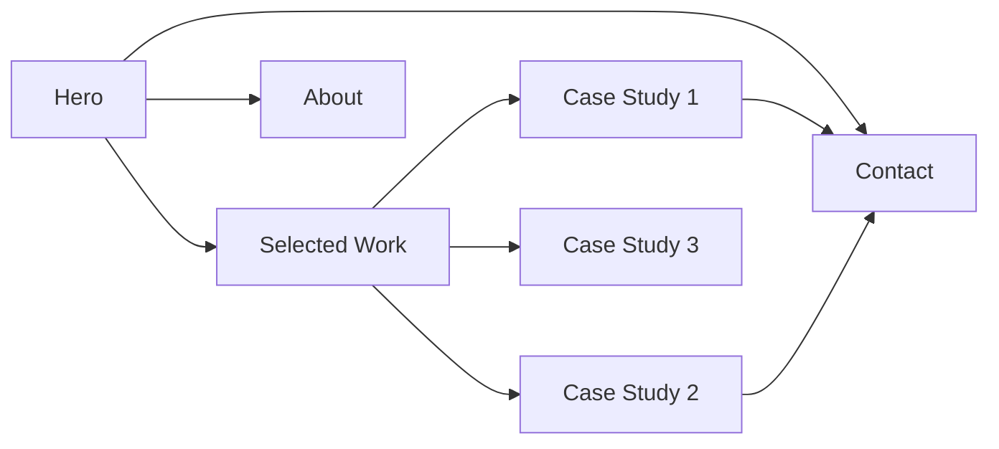

# Product Designer Portfolio Site — Plan

## 1. Goal
A fast, high-contrast portfolio that immediately shows a clear design point of view, then funnels recruiters and potential clients to case studies and contact details.

## 2. Audience
- Recruiters / hiring managers
- Potential freelance clients

## 3. Stack
- **Build:** Static HTML / CSS / vanilla JavaScript
- **Templating:** Reusable HTML partials loaded via JS
- **Styling:** CSS custom properties, CSS Grid / Flexbox, no framework
- **Assets:** Optimized images and fonts
- **Hosting:** Vercel or Netlify

## 4. Site Structure
Single-page scrolling site with dedicated case-study detail pages.

Legend:
- A = landing hero
- B = work grid
- Cn = individual project pages
- D = about section/page
- E = contact form/section

## 5. Design Direction
- **Personality:** Bold, expressive, high contrast
- **Color system:** One primary accent color against near-black and off-white backgrounds
- **Typography:** One strong display typeface for headings, one readable sans-serif for body
- **Hero:** Full-width statement, name, role, and a clear call to action
- **Work section:** Large project cards with bold titles, short outcome statements, hover states
- **Case study pages:** Problem → Process → Outcome, big images, short paragraphs
- **About:** Photo or illustration, short bio, skills/tools, download resume link
- **Contact:** Email, LinkedIn, and a simple form

## 6. Content Plan
Starting from scratch, include:
- Case-study writing template (problem, role, process, results, visuals)
- Placeholder projects that can be swapped in
- Content checklist for bio, resume, and project assets

## 7. Implementation Phases
1. Scaffold repo, design tokens, and base layout
2. Build hero + navigation
3. Build selected work grid
4. Build case-study page template
5. Build about and contact sections
6. Responsive pass, accessibility, and performance
7. Deploy and connect custom domain

## 8. Deliverables
- Fully working static site in `/Users/natasa/Projects/Test_sajt`
- README with instructions for adding new case studies
- Deployment config for Vercel/Netlify
